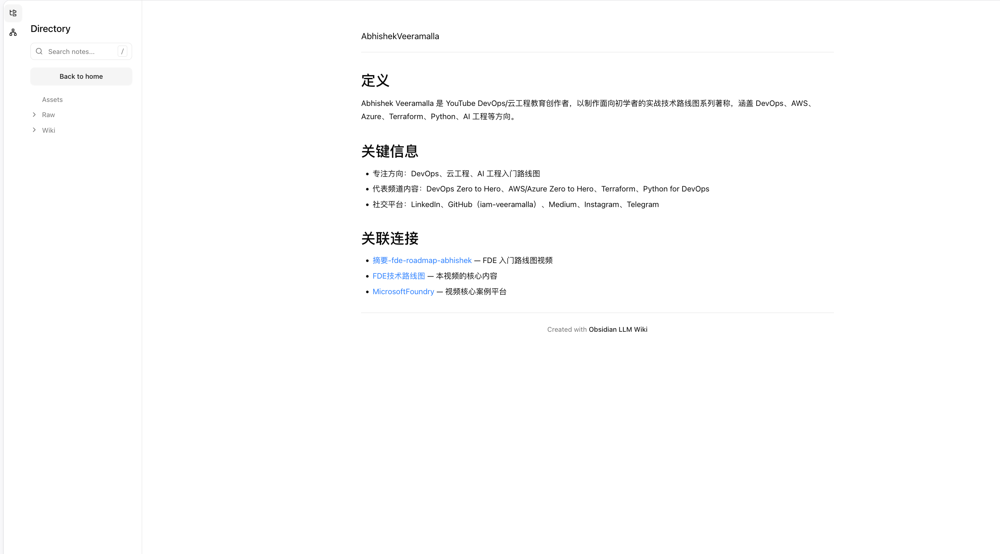
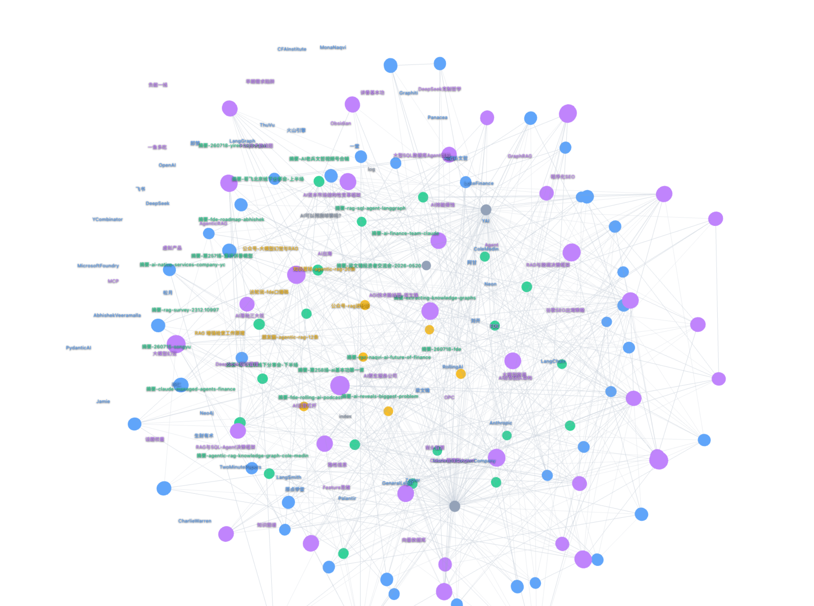

# Obsidian LLM Wiki

[English](./README.md) · [中文](./README-zh.md)

<a id="english"></a>

## English

Obsidian LLM Wiki is a self-hosted knowledge base for publishing an Obsidian vault as a searchable website. It turns Markdown notes into routed Next.js pages and adds Wiki-style links, full-text search, theme switching, and an interactive 3D knowledge graph.

Repository: [github.com/darrenli6/obsidian-llm-wiki](https://github.com/darrenli6/obsidian-llm-wiki)

## Preview

### Published note



### Interactive 3D knowledge graph



## Features

- File-based routing from `content/`.
- Obsidian Markdown and MDX rendering.
- Wiki links such as `[[AgenticRAG]]` and `[[AgenticRAG|related concept]]`.
- Full-text fuzzy search with a generated search index.
- Interactive Three.js 3D knowledge graph built from `content/wiki` relationships.
- Node labels, category colors, orbit controls, zoom, hover feedback, and note navigation.
- Directory navigation with a dedicated graph entry point.
- Light and dark themes.
- Syntax highlighting, GFM tables, and KaTeX math rendering.
- Vercel-ready deployment.

## Tech Stack

Next.js 15 · React 19 · TypeScript · Tailwind CSS · Three.js · `next-mdx-remote` · `next-themes`

## Getting Started

```bash
git clone https://github.com/darrenli6/obsidian-llm-wiki.git
cd obsidian-llm-wiki
pnpm install
pnpm dev
```

Open [http://localhost:3000](http://localhost:3000).

Place your Obsidian Markdown files inside `content/`. The folder structure becomes the URL structure. Set `publish: false` to hide a note; notes are published by default unless they explicitly set this flag.

```yaml
---
title: Agentic RAG
type: concept
tags: [RAG, AI]
publish: true
---

Related notes: [[GraphRAG]] and [[Knowledge Graph|knowledge graphs]].
```

## Knowledge Graph

The graph is generated from Markdown files under `content/wiki`.

- Files become graph nodes.
- The frontmatter `type` controls the node category and color.
- `[[WikiLink]]` references become graph edges.
- Click a node to open the related note.
- Drag to rotate the 3D scene; scroll to zoom.
- Use the fullscreen control for a larger graph view.

Supported categories include `entity`, `concept`, `source`, and `synthesis`.

## Project Structure

```text
app/                         Next.js routes and layouts
components/                  UI and interactive graph components
content/                     Obsidian Markdown content
data/                        Content directory configuration
lib/content.ts               Content loading and routing helpers
lib/knowledge-graph.ts       Wiki graph extraction
lib/remark-obsidian-links.ts Obsidian link transformation
public/                      Static assets and screenshots
scripts/                     Search index generation
```

## Deployment

1. Push the repository to GitHub.
2. Import it into Vercel.
3. Use `pnpm build` as the build command.
4. Deploy.

[Deploy with Vercel](https://vercel.com/new/clone?repository-url=https%3A%2F%2Fgithub.com%2Fdarrenli6%2Fobsidian-llm-wiki)

## Scripts

```bash
pnpm dev          # Generate the search index and start the dev server
pnpm build:index  # Generate the search index
pnpm build        # Build the production application
pnpm start        # Start the production server
pnpm lint         # Run Biome linting
pnpm format       # Format the project with Biome
```

## License

MIT License. See [LICENSE](./LICENSE).
